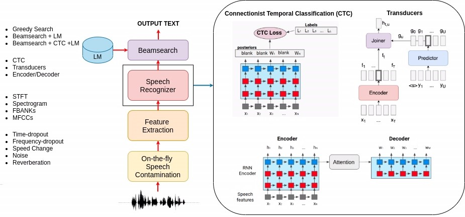

  

<h1 align="center">Speech Processing Machine Learning Project:
 Data Augmentation, Tokenization, 
 Connectionist Temporal Classification, 
 Transducers, Encoder-Decoder with Attention, Beamsearch of language models
</h>

  
  

## Overview
The Project provides a comprehensive guide to building a speech recognition system using machine learning techniques, with a focus on computational linguistics. It outlines the various stages involved in the process, including data preprocessing, feature extraction, model training, and deployment. 

The proposed system contains all the basic ingredients to develop a state-of-the-art system (i.e., data augmentation, tokenization, language models, beamsearch, attention, etc).

The detailed explanations & references are provides for each stage of the process, making it a valuable resource for anyone interested in building speech recognition systems using machine learning techniques.

### Preprocessing
The speech recognition process begins with the raw waveform directly. The original waveform undergoes contamination through various speech augmentation techniques, such as time/frequency dropout, speed change, adding noise, and reverberation. These disturbances are activated randomly based on user-specified probabilities and are applied on-the-fly without the need to store augmented signals on disk.

For a deeper understanding of the contamination techniques, tutorials on speech augmentation and environmental corruption are provided.

### Feature Extraction
Speech features, such as Short-Term Fourier Transform (STFT), spectrograms, FBANKs, and MFCCs, are extracted from the contaminated waveform. Thanks to a highly efficient GPU-friendly implementation, these features can be computed on the fly.

For more detailed information, tutorials on speech representation and speech features are available.

### Speech Recognition Techniques
The features extracted from the waveform are fed into the speech recognizer, a neural network mapping input feature sequences to output token sequences (e.g., phonemes, characters, subwords, words). SpeechBrain supports popular techniques like Connectionist Temporal Classification (CTC), Transducers, or Encoder/Decoder with attention.

Posterior probabilities over output tokens are processed by a beamsearcher that explores alternatives and outputs the best one. Optionally, alternatives can be rescored with an external language model, which may be based on RNN or transformers.

### Training and Deployment
Training and deploying the speech recognition system involve several steps. Each step is crucial for building an effective end-to-end speech recognizer:

1. **Data Preparation**: Create data manifest files specifying the location of speech data and corresponding text annotations.

2. **Tokenizer Training**: Train a tokenizer to decide on basic units for training the speech recognizer and language model.

3. **Language Model Training**: Train a language model using a large text corpus.

4. **Speech Recognizer Training**: Train the speech recognizer using a chosen model with an autoregressive decoder and attention mechanism.

5. **Inference**: Deploy the trained speech recognizer for inference.
